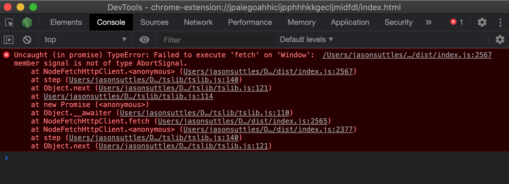

#Azure Fetch Test for NW.JS
To run this test:
1. Clone this repo
2. Run `npm install`
3. Set environment variables for AZURE_ACCOUNT and AZURE_SAS_TOKEN. The AZURE_ACCOUNT variable is your Azure account name. The AZURE_SAS_TOKEN variable is your Azure SAS token.
4. Run `npm start`
5. A blank window and a chrome DevTools console should appear.

###Expected
The containers within the Azure storage account are listed.

###Actual
The error shown below occurs.
